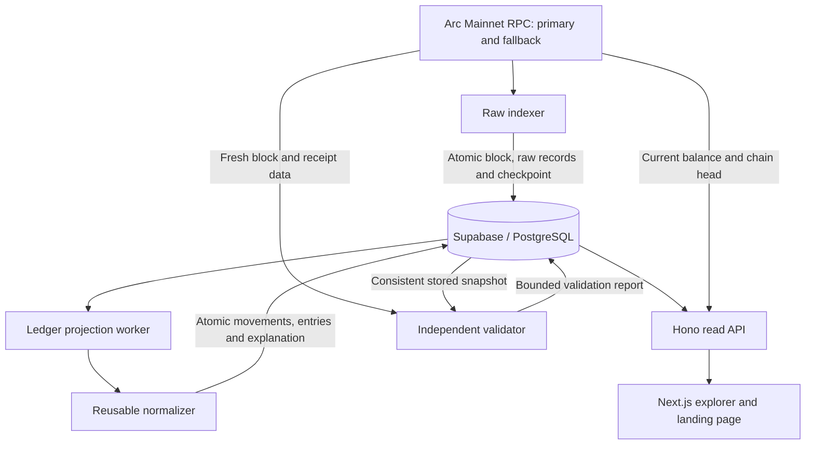

# ArcLedger

**The accounting layer for Arc USDC.** Normalize native transfers, ERC-20 activity and gas into one canonical ledger.

Arc exposes one USDC balance through an 18-decimal native representation and a 6-decimal ERC-20 interface. Counting both Transfer streams doubles economic activity. ArcLedger retains raw evidence, matches representations one-to-one, counts native movements once, and accounts for receipt-derived gas fees separately. ERC-20 self transfers retain a zero-balance-change audit record.

The five-part MVP includes raw ingestion, Supabase/PostgreSQL persistence, a reusable normalizer, exact address accounting, four public read APIs, an explorer UI, independent Mainnet validation, and Railway deployment assets. Published to [GitHub](https://github.com/anoop04singh/ArcLedger) and deployed on Railway. Open the [website](https://web-production-e1571d.up.railway.app) or [live explorer](https://web-production-e1571d.up.railway.app/explorer). The explorer reports actual indexed coverage and lag; deployment does not imply the historical backlog is caught up.

## Contents

- [The problem](#the-problem)
- [What makes ArcLedger different](#what-makes-arcledger-different)
- [Who it is for](#who-it-is-for)
- [Architecture](#architecture)
- [Repository layout](#repository-layout)
- [Local demo](#local-demo)
- [Mainnet and Supabase](#mainnet-and-supabase)
- [Read API](#read-api)
- [Tests and validation](#tests-and-validation)
- [Deploy yourself to Railway](#deploy-yourself-to-railway)
- [Rolling history: 400 MB database budget](#rolling-history-400-mb-database-budget)
- [Future use cases](#future-use-cases)
- [Contributing](#contributing)

## The problem

A blockchain event is evidence of activity, but it is not necessarily a separate economic movement. On Arc, USDC has a native representation with **18 decimals** and an ERC-20 interface with **6 decimals**. One payment can produce both a native system transfer event and an ERC-20 Transfer event.

An indexer that adds every transfer log together can turn a single 10 USDC payment into 20 USDC of reported activity. Deduplicating by transaction hash does not solve this: a transaction can contain several legitimate movements, including repeated transfers between the same participants for the same amount.

| Evidence for an illustrative payment | Raw integer amount | Decimals | Economic meaning |
| --- | --- | --- | --- |
| Native transfer | `10000000000000000000` | 18 | 10 USDC |
| Matching ERC-20 transfer | `10000000` | 6 | The same 10 USDC |
| Canonical ledger result | `10000000000000000000` | 18 | **10 USDC counted once** |

This affects payment histories, treasury reports, volume dashboards and accounting systems that mistake multiple representations for multiple payments. Other details matter too: native precision can exceed six decimals, the transaction submitter may be a relayer rather than the token owner, and a failed transaction can still pay a fee.

ArcLedger preserves protocol evidence, identifies economic movements, and derives address-level accounting entries. It does not add a token, custody funds, or require a smart contract.

## What makes ArcLedger different

### Match evidence one-to-one

The normalizer scales ERC-20 units by `10^12` into the native 18-decimal domain. It matches records within the same transaction by exact sender, recipient and amount, consuming one native match per ERC-20 representation. Two identical legitimate payments remain two movements; another representation does not become another payment.

Native events are the usual canonical source. A nonzero ERC-20 self-transfer can retain an audit record with zero transfer balance change, because Arc does not emit the corresponding native system event for that case. Other unmatched ERC-20 evidence produces a warning and is excluded from economic totals. See the [normalization contract](docs/normalization.md) for the exact rules.

### Keep amounts exact and fees separate

Accounting uses JavaScript `BigInt`, PostgreSQL `numeric(78,0)` and decimal strings in public APIs. Native amounts are not rounded to six decimals for storage or arithmetic. Compact explorer values link to full exact transaction amounts.

The fee comes from the receipt, in native 18-decimal USDC:

```text
feeRaw = gasUsed × effectiveGasPrice

Illustrative sender accounting:
Transfer          -10.000000 USDC
Network fee        -0.000031 USDC
Net change        -10.000031 USDC
```

Fees are allocated once to the transaction submitter. Recipients do not inherit the sender's fee; a relayer's fee belongs to the relayer. Reverted transactions retain their fee without inventing a successful transfer. In a transaction with several movements, total transfer volume is distinct from any one address's net change.

### Explain the result and preserve the evidence

A transaction explanation connects each canonical movement to its source records, source precision, log indices and duplicate decisions. Original transaction, receipt and log payloads remain available for the **retained history window**, including through `?includeRaw=true`.

A separate validator fetches fresh RPC data and uses independent decoding and accounting logic to compare it with stored results. Validation proves checks over a named sample; it does not certify every historical balance.

## Who it is for

| User | What the current MVP provides |
| --- | --- |
| Finance and treasury teams | Exact transfer/fee breakdowns, counterparties and transaction evidence |
| Wallet and dashboard developers | Live RPC balances alongside canonical, cursor-paginated activity |
| Analysts and researchers | Movement records without matched representation double-counting, with explicit coverage limits |
| Payment application developers | Read APIs and explanations without writing their own event-matching engine |
| Infrastructure operators | Independent workers, restart checkpoints, lag reporting and bounded storage |

The hosted explorer demonstrates the implementation. The repository supports self-hosting; it is not a managed accounting service or an archival data guarantee.

## Architecture



### 1. Raw ingestion: preserve evidence first

The Node.js/TypeScript indexer uses viem-backed RPC access to read committed blocks, transactions, receipts and logs. Requests try the primary provider and then the fallback; both endpoints are checked against the configured chain. Receipt logs and block logs must agree before a block is committed.

Fetching has bounded concurrency, while block commits remain ordered. Each block and its raw records commit together with `last_processed_block`. Unique constraints and idempotent writes make replay safe after a restart or a lost commit acknowledgement. A dedicated PostgreSQL session holds the writer lock to prevent concurrent raw writers.

`INDEX_START_BLOCK` selects a new installation's starting point; an existing checkpoint takes precedence. Arc's deterministic finality removes the need for a confirmation delay. Incomplete RPC results retry without advancing the checkpoint, while conflicting committed block metadata stops ingestion for investigation.

### 2. Ledger projection: interpret independently

The ledger worker reads retained transactions awaiting normalization and passes their receipt/log evidence to `packages/normalizer`. Canonical transfers, address entries and explanations are written atomically.

Projection is separate from raw ingestion. A parsing failure leaves the original evidence available, while status and transaction responses expose pending projection instead of presenting incomplete accounting as finished. Raw indexing progress and canonical projection progress can differ.

### 3. Database: raw, derived and operational records

| Tables | Purpose |
| --- | --- |
| `blocks`, `transactions`, `raw_events` | Block metadata, original transaction/receipt payloads and protocol logs |
| `transfers` | Canonical economic movements and matching evidence |
| `address_entries` | Per-address transfers, self-transfer records and fee accounting |
| `indexer_state` | Durable ingestion checkpoint and operational state |
| `validation_runs` | Independent validation sample bounds, outcomes and findings |
| `webhooks`, `webhook_deliveries` | Reserved schema; no active delivery worker |

Versioned migrations maintain the schema. Both workers cooperate with the [400 MB retention policy](#rolling-history-400-mb-database-budget): raw and derived history expire together by complete block.

### 4. Read API: live balances, indexed history

The Hono service exposes four core read endpoints. Current balances use block-pinned `eth_getBalance`. Received/sent totals, fees and history come from the indexed database window. This distinction matters: a recent-history index cannot reconstruct a lifetime balance, and non-event state changes can affect balances.

Pagination uses opaque cursors, not page numbers. A recorded transaction without a completed projection returns a pending response. Public reads are rate-limited; database/RPC failures remain explicit and never trigger substitution of demo data.

### 5. Frontend: make accounting inspectable

Next.js serves the landing page, live explorer, address history, transaction explanations and network/validation status. Server-side API access and fixed same-origin relays keep backend credentials out of the browser.

The explorer shows measured lag, recent projected transactions, duplicate counts, retained coverage and validation scope. Its 15-second refresh is a UI polling interval, not an ingestion latency guarantee. Motion animations respect reduced-motion preferences.

### 6. Validation and security boundaries

The validator compares fresh RPC records with a repeatable-read database snapshot. Its independent decoder and arithmetic oracle do not invoke the normalizer to generate expected results. Reports identify the exact block range, completion time and `VALID`, `INVALID` or `ERROR` outcome.

Remote PostgreSQL connections verify TLS. Backend-owned Supabase tables have RLS enabled without public policies, and browser-role grants are revoked. Browsers use the read API rather than accessing tables directly. Public reads require no wallet connection, user account or API key.

## Repository layout

```text
apps/
  indexer/          Raw block ingestion worker
  api/              Hono read API and data access
  web/              Next.js landing page and explorer
packages/
  arc-config/       Network configuration and RPC transport
  database/         Connections, migrations and persistence
  normalizer/       Reusable movement, fee and duplicate normalization
  types/            Shared contracts and types
scripts/            Ledger worker, validation and operational commands
examples/           Example integrations
tests/             Automated coverage
docs/              Architecture, API and operational runbooks
```

Production uses **four long-running services**: web, API, indexer and ledger. The ledger entry point is `scripts/project-worker.ts`; it is a separate process sharing PostgreSQL, not an additional database. The validator runs on demand.

## Local demo

Requires Node.js 22.16+ and npm:

```sh
npm ci
npm run dev
```

Open http://127.0.0.1:3000 (API: http://127.0.0.1:3001). With no .env, explicitly labeled demo data needs no database. An existing .env selecting Mainnet continues to use Mainnet.

## Mainnet and Supabase

Copy .env.example to the git-ignored .env and configure:

```ini
ARCLEDGER_MODE=mainnet
DATABASE_URL=<Supabase Session Pooler URL, port 5432>
DATABASE_SSL_CA_FILE=<absolute path to downloaded Supabase CA>
PRIMARY_RPC_URL=<Arc Mainnet provider>
FALLBACK_RPC_URL=<independent Arc Mainnet provider>
API_URL=http://127.0.0.1:3001
```

Remote PostgreSQL verifies TLS. Transaction Pooler port 6543 is unsupported. Railway can use DATABASE_SSL_CA containing multiline PEM instead of a local certificate path. No Supabase API key is required. Never put database/private RPC credentials in NEXT_PUBLIC_* variables.

```sh
npm run check:database
npm run db:migrate
npm run check:rpc
npm run dev:indexer
# Separate terminal: required canonical projection worker
npm run dev:ledger
# Separate terminal: API and web
npm run dev
```

For local PostgreSQL instead, use `docker compose up -d` and the example localhost connection. Supabase users do not need Docker.

INDEX_START_BLOCK selects the initial backfill block; unset it to begin at the current committed head. A persisted checkpoint always wins on restart. Arc blocks are final on inclusion; incomplete RPC results retry without advancing the checkpoint. Run one raw worker and one ledger worker. `project:once` processes up to 100 pending transactions for bounded checks.

## Read API

| Endpoint                                            | Purpose                                                 |
| --------------------------------------------------- | ------------------------------------------------------- |
| GET /v1/status                                      | Database/RPC health, head, lag, coverage and validation |
| GET /v1/address/:address                            | RPC balance and indexed received/sent/fee totals        |
| GET /v1/address/:address/ledger?limit=50&cursor=... | Stable cursor-paginated address entries                 |
| GET /v1/tx/:txHash                                  | Canonical movements, fee and matching evidence          |

Add `?includeRaw=true` to the transaction endpoint for retained transaction/receipt/log payloads. Public reads have bounded rate limits and no accounts/API keys. See [API details](docs/api.md).

## Tests and validation

```sh
npm test
npm run build
# Demo API/web running, with Playwright Chromium installed:
npm run test:ui
# Configured Supabase with indexed and projected blocks:
npm run validate:mainnet
```

The validator defaults to the latest five stored raw blocks. VALIDATION_START_BLOCK and VALIDATION_END_BLOCK select 1–1000 contiguous blocks. It independently decodes freshly fetched RPC logs, compares raw/canonical records and exact 18/6 matching, and checks receipt fees and address net changes. Results persist in validation_runs and .local/mainnet-validation.json. It prints VALID/INVALID/ERROR and exits nonzero on failure. Empty samples and pending projections cannot pass.

`/validation` shows actual sample bounds and completion time. Zero mismatches means no failed checks **in that sample**, not lifetime reconciliation or certification of later blocks. Validator rewards and other non-event balance changes remain outside this scope.

Tests cover native/dual events, precision/dust, repeated participants, self transfers, relayer/failed-transaction fees, pagination, replay, interrupted writes, restart and lost commit acknowledgements. `test:mainnet` and `test:ledger:mainnet` use isolated local databases; `verify:database` tests bounded ingestion/restart against the configured database. See [test evidence](docs/testing.md).

## Deploy yourself to Railway

Follow the [Railway runbook](docs/railway.md): four root-workspace services (web, api, indexer, ledger), one Dockerfile, Supabase Session Pooler, verified TLS, private API networking and public domains. Exact commands and variables are provided. Web requires only API_URL, never database credentials. No deployment is performed by this repository's build/test commands.

## Scope and documentation

No smart contract is required. Webhook tables remain reserved and unused. Authentication, billing, multichain support, tax reporting and analytics are outside this MVP. Demo data never substitutes for a failed Mainnet connection.

Read [architecture](docs/architecture.md), [normalization](docs/normalization.md), [API](docs/api.md), [Part 5 validation/demo](docs/part-5.md), [Railway](docs/railway.md), and the earlier [ingestion](docs/part-2.md), [ledger](docs/part-3.md), [Supabase](docs/part-4.md) runbooks.

MIT licensed.

## Rolling history: 400 MB database budget

This deployment is **a recent-history ledger, not an archival indexer**. Its database budget is **400,000,000 bytes (400 decimal MB)** to leave headroom under the Supabase Free database allowance. Both Mainnet workers enforce the policy automatically; no extra scheduler is required.

- Before each new block, the indexer measures `pg_database_size(current_database())`, including tables, indexes, TOAST and other database objects. It reserves at least 16 MB (or 12× the incoming JSON size) for raw writes and downstream accounting. Oversized blocks pause ingestion rather than bypassing the limit.
- Cleanup starts conservatively when measured size plus the reservation reaches **300 MB**. It aims for **220 MB including the reservation**, rather than filling the entire allowance. The ledger worker waits near the cleanup threshold and projects bounded batches of 20 transactions.
- Raw ingestion and ledger projection also measure allocated database size **before COMMIT**. A write reaching 300 MB rolls back; the indexer must reclaim space before retrying. This guard also covers growth larger than the pre-write estimate.
- Production ingestion uses the migration-installed `arcledger_ingest` function to validate and commit one complete block in a single database round trip. It runs with the caller's permissions, is inaccessible to public browser roles, and includes the 300 MB rollback guard inside the same atomic statement.
- Oldest blocks expire first. Their raw logs, receipts, transactions, transfers and address entries are deleted **together in one transaction**. The latest committed block and ingestion checkpoint remain, so the next block still verifies its parent and resumes normally. A retained block is never partially discarded.
- The indexer holds the raw writer lock and the projection lock during maintenance. `VACUUM FULL` then physically compacts the affected tables/indexes. Ordinary DELETE/VACUUM does not reliably shrink allocated database size. Compaction can temporarily block database-backed reads and needs temporary disk space; it is deliberately started below the budget.
- Interrupted compaction is recorded and retried before more history is removed. If the remaining data, unrelated database objects, permissions, or an oversized block prevent safe reclamation, ingestion **pauses with its checkpoint intact** instead of continuing to fill storage.
- Retained coverage moves forward in `/v1/status`, the explorer, and address pages. Received/sent/fees/transaction counts describe **retained history only**, never lifetime totals. Current balances still use Arc RPC. Pruned transaction hashes return 404; pagination cannot recover expired entries, so reload history if the window moves while browsing.
- Validation reports whose sample overlaps pruned history expire too, avoiding a misleading VALID badge for missing evidence. Run a fresh validation against retained, fully normalized blocks.

The 400 MB value is an application storage budget, not a PostgreSQL disk quota: WAL, temporary compaction files, provider accounting delays, or external writes are outside the indexer's byte accounting. The 300/220 MB operating thresholds leave room for these effects. Do not put unrelated large datasets in this database or disable retention. Deletion is permanent; export needed history before it expires.

If a database is already over quota and read-only, stop both writers first. Use Supabase's [documented maintenance-session procedure](https://supabase.com/docs/guides/platform/database-size#disabling-read-only-mode) to allow cleanup, migrate, prune and compact; verify size before restarting. Do not enable normal ingestion as a workaround for the quota. See [Railway operations](docs/railway.md).

## Landing and explorer interactions

The landing page explains the problem, matching, fee treatment, validation scope and rolling history. Its editorial design follows the supplied Monad tokens: warm parchment, serif headings, monospace interface text, thin borders, rounded panels, pastel accents and a blue primary action. The hero illustrates two protocol records becoming one movement and explicitly labels its sample data.

Interactive normalization examples, API response previews with copy controls, installation commands and a keyboard-accessible FAQ connect the explanation to the implementation. Animations use `motion/react` and respect reduced-motion preferences.

The explorer uses real status and recent-transaction responses, 15-second refresh, pause/resume, manual refresh and All activity / Transfers / Fee only filters. Transfers are selected initially. Loading, unavailable and stale-data states remain explicit. Long fractional amounts use an ellipsis in compact rows; transaction links expose full exact values. Storage details expand on demand, maintenance warnings remain visible, and validation badges describe a specific sample.

Supabase's informational [RLS enabled without policies notice](https://supabase.com/docs/guides/database/database-linter?lint=0008_rls_enabled_no_policy) is intentional here: public Data API access is denied; the backend connects with its owner role.

## Future use cases

These are **potential extensions, not implemented features or delivery commitments**. Each builds on the canonical ledger and its evidence model.

### Payment reconciliation and merchant operations

A payment integration could associate canonical movements with invoices or payment intents, detect underpayments and overpayments, and show network fees separately. Durable webhooks could notify merchant systems when an indexed payment is ready. This requires application references, authenticated delivery, retries and idempotent consumers; the reserved webhook tables do not provide those capabilities today.

### Treasury monitoring and accounting exports

Teams could monitor controlled address lists, classify internal transfers, distinguish external spending from fees, and export entries into ERP or bookkeeping workflows. Address ownership, chart-of-accounts mapping and period-close rules would be additional application layers. Existing self-transfer and relayer handling provide a more accurate starting point.

### Wallet activity and embedded explanations

Wallets could embed the transaction explanation model to show what moved, who paid the fee and why two logs represent one payment. A client SDK could provide typed pagination and evidence access, reducing the custom code needed to build accurate activity feeds.

### Auditable analytics and research

An analytics layer could compute payment volumes, fee distributions and counterparty activity over defined coverage. Long-range research would need archival storage or exports before retention removes the evidence. Derived charts should retain coverage and normalization-version metadata so a moving history window cannot masquerade as a change in economic activity.

### Larger deployments and archival storage

Operators with larger storage budgets could separate recent query data from immutable evidence archives, add durable export pipelines and tune ingestion for higher-throughput RPC providers. These extensions require explicit retention, replay and retrieval guarantees. The current 400 MB deployment intentionally retains a rolling window.

### Broader reconciliation and operational controls

Future reconciliation could account for validator rewards and other non-event balance changes, then compare independently reconstructed deltas with chain state over a chosen range. Scheduled validation, alerts for lag or storage pressure, and richer projection diagnostics could support production operations. Today's transaction-level validation must not be interpreted as that broader balance reconciliation.

### Optional platform features

Authentication, API keys, organizations, billing and multichain support could be added if a hosted product requires them. They remain outside the MVP. Another chain would need explicit event and fee semantics rather than assuming Arc's matching rules apply unchanged. Tax reporting requires jurisdiction-specific rules beyond this ledger's scope.

## Contributing

Start with the [architecture](docs/architecture.md), [normalization rules](docs/normalization.md) and [API contract](docs/api.md). Keep ingestion independent from interpretation, preserve exact integer arithmetic, and retain enough evidence to explain every accounting decision.

For a normalization bug, include the transaction hash, affected block range, expected economic movement and a sanitized description of the observed result. Do not publish database URLs or private RPC credentials. Retained raw evidence or a minimal fixture helps make a regression reproducible before history expires.

Code changes should include relevant regression coverage and documentation updates when public behavior changes. Documentation-only edits do not require running the application or deploying services. See [testing](docs/testing.md) for the existing suites and bounded Mainnet validation workflow.

## License

ArcLedger is open source under the [MIT License](LICENSE).
